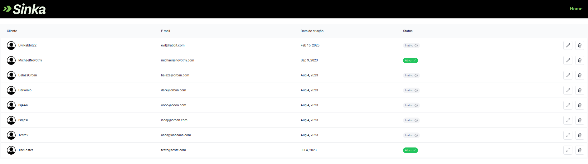
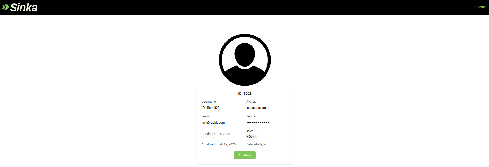
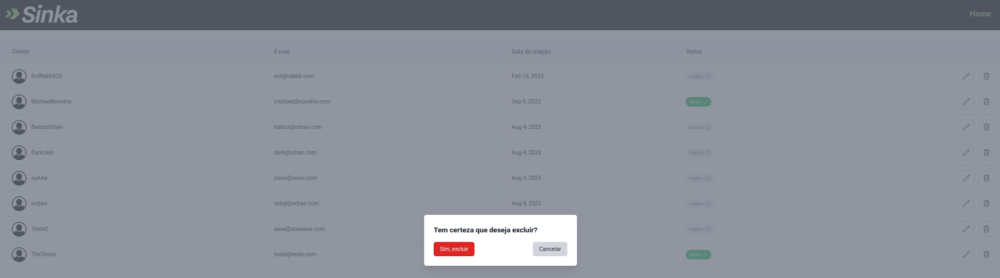

# Como rodar o front-end

Depois do backend já estiver rodando:

```
node ./scripts/populate_db.js   # popular a database com dados placeholder
npm install                     # instalar os módulos
cp .env.example .env            # copiar as variáveis de ambiente
npm run dev                     # inicializar a aplicação (ambiente de desenvolvimento)
```

Vá até http://localhost:3000 para visualizar a aplicação web.

## Página principal



## Informações do cliente



## Deletar um cliente


